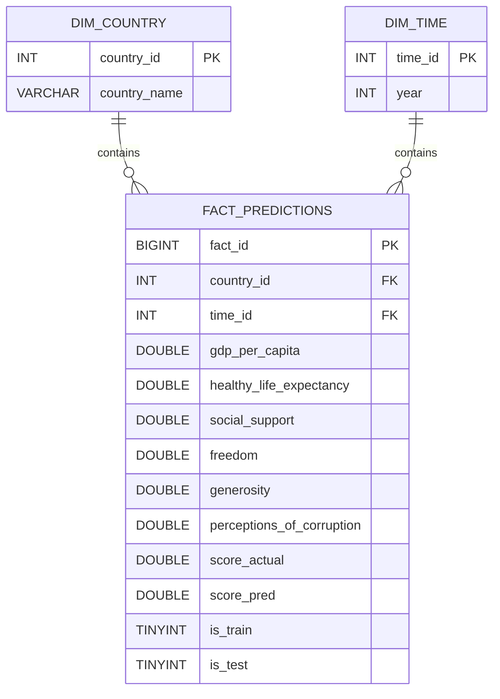

# Workshop 3 — ETL Process using Apache Kafka + Machine Learning

## Introduction

This project develops a complete predictive system that combines ETL processes, Machine Learning, and real-time data streaming using Apache Kafka to predict the **World Happiness Index (Happiness Score)** from 2015 to 2019.

The workflow is divided into two complementary stages:

1. **Offline Process (Batch):** includes Exploratory Data Analysis (EDA), data cleaning, integration of five annual datasets, and the training of multiple regression models. The most suitable model is selected based on performance metrics and statistical validation.
2. **Online Process (Streaming with Kafka):** implements a real-time data flow where a **Kafka Producer** sends transformed records, and a **Kafka Consumer** loads the trained model to generate predictions and store them in a **MySQL database** under a **Star Schema** structure.

---

## General Objective

To train a regression model capable of predicting the **Happiness Score** based on socioeconomic indicators, and deploy it within a **real-time data streaming pipeline** using Apache Kafka, storing the predictions in a relational data warehouse for analytical purposes.

---

## Technologies Used

| Component            | Technology                                                  |
| -------------------- | ----------------------------------------------------------- |
| Programming Language | Python 3.11                                                 |
| Streaming Framework  | Apache Kafka                                                |
| Machine Learning     | Scikit-learn                                                |
| Visualization        | Plotly + Dash                                               |
| Database             | MySQL Workbench                                             |
| Main Libraries       | pandas, numpy, kafka-python, joblib, mysql-connector-python |
| Environment          | WSL + Windows 10/11                                         |

---

## Project Structure

```bash
WORKSHOP_3/
│
├── data/                      # Source data (World Happiness Report 2015–2019)
│   ├── 2015.csv
│   ├── 2016.csv
│   ├── 2017.csv
│   ├── 2018.csv
│   ├── 2019.csv
│   └── df_all.csv             # Cleaned and concatenated dataset (EDA result)
│
├── model/
│   └── happiness_regression.pkl   # Trained model (Multiple Linear Regression)
│
├── artifacts/
│   └── split_membership.csv       # Train/test membership for labeling predictions
│
├── eda.ipynb                      # Data cleaning, unification, and exploratory analysis
├── predictive_model.ipynb         # Model training and comparison
├── happiness_model_dashboard.py   # Interactive performance dashboard
├── producer_happiness.py          # Kafka Producer (real-time data flow)
├── consumer_happiness.py          # Kafka Consumer (prediction + database load)
├── requirements.txt
└── README.md
```

---

## 1. Offline Process: EDA and Predictive Modeling

### Exploratory Data Analysis (EDA)

The EDA was performed in **`eda.ipynb`**, where the five datasets from the **World Happiness Report (2015–2019)** were loaded and standardized.

The cleaning and integration steps included:

* Renaming columns using a mapping dictionary to ensure consistent naming.
* Adding a **Year** column to each dataset.
* Interpolating missing values in **Perceptions of corruption** using linear interpolation.
* Normalizing country names (e.g., “Hong Kong S.A.R., China” → “Hong Kong”).
* Removing derived variables such as **Rank**, **Dystopia Residual**, and **Standard Error** to avoid data leakage.
* Concatenating all datasets into a single clean file called **df_all.csv**, which served as input for the modeling phase.

---

### Model Training and Selection

The modeling phase was carried out in **`predictive_model.ipynb`**, where four supervised regression models were evaluated:

| Model                                | Description                                                                             | Regularization      |
| ------------------------------------ | --------------------------------------------------------------------------------------- | ------------------- |
| **Multiple Linear Regression (OLS)** | Baseline model without penalization, interprets linear relationships between variables. | None                |
| **Ridge Regression**                 | L2 regularization, reduces variance and mitigates overfitting.                          | α = 0.001           |
| **Lasso Regression**                 | L1 regularization, performs feature selection.                                          | α = 0.001           |
| **Elastic Net**                      | Combination of L1 and L2 regularization.                                                | α = 0.001, l1 = 0.1 |

### Comparative Results

| Model                             | R²         | MAE        | RMSE       |
| --------------------------------- | ---------- | ---------- | ---------- |
| **Linear Regression**             | **0.7265** | **0.4486** | **0.5844** |
| Ridge (α = 0.001)                 | 0.7265     | 0.4486     | 0.5844     |
| Lasso (α = 0.001)                 | 0.7263     | 0.4487     | 0.5845     |
| Elastic Net (α = 0.001, l1 = 0.1) | 0.7264     | 0.4486     | 0.5844     |

**Model selection rationale:**

Although regularized models (Ridge, Lasso, ElasticNet) were tested, the optimal α values obtained through **GridSearchCV** were extremely low (≈ 0.001).
This indicates that the dataset did not suffer from overfitting or strong multicollinearity, so additional penalization was unnecessary.
Therefore, the **Multiple Linear Regression (OLS)** model was chosen as the final model because it achieved the same predictive performance while remaining simpler and more interpretable.

---

### Statistical Validation

| Assumption             | Evidence                                                     | Result           |
| ---------------------- | ------------------------------------------------------------ | ---------------- |
| Linearity              | Strong alignment between actual and predicted values (y = x) | Satisfied        |
| Homoscedasticity       | Breusch–Pagan test p = 0.0583 > 0.05                         | Satisfied        |
| Normality of residuals | QQ-plot aligned; Jarque–Bera p = 0.0031                      | Slight deviation |
| Independence           | Durbin–Watson = 2.209                                        | Satisfied        |
| Multicollinearity      | All VIF values < 3                                           | Satisfied        |

---

### Coefficient Interpretation

| Variable                  | Coefficient | Interpretation                                               |
| ------------------------- | ----------- | ------------------------------------------------------------ |
| Freedom                   | 1.62        | Greater perceived freedom significantly increases happiness. |
| GDP per Capita            | 1.08        | Higher income levels are associated with higher happiness.   |
| Healthy life expectancy   | 0.98        | Better health conditions improve overall well-being.         |
| Social support            | 0.63        | Stronger social networks correlate with greater happiness.   |
| Perceptions of corruption | 1.04        | Lower corruption perception leads to higher happiness.       |
| Generosity                | 0.40        | Positive but weaker effect compared to other factors.        |

The model explains **77.8 % of the variance** in the training set (R² = 0.778) and **72.6 % in the test set (R² = 0.726)**, showing no signs of overfitting.

---

## 2. Online Process: Data Streaming with Apache Kafka

### Kafka Producer (`producer_happiness.py`)

* Loads annual datasets (2015–2019).
* Standardizes column names and country labels.
* Interpolates missing values in **Perceptions of corruption**.
* Sends each record as JSON to the topic **`happiness-topic`**.
* Introduces a short delay between messages to simulate real-time flow.

### Kafka Consumer (`consumer_happiness.py`)

* Subscribes to the **`happiness-topic`**.
* Loads the trained model **happiness_regression.pkl**.
* Predicts the Happiness Score for each incoming record.
* Automatically creates the **dim_country**, **dim_time**, and **fact_predictions** tables in MySQL.
* Inserts the original and predicted values, along with **is_train** and **is_test** flags, into the fact table.

---

## 3. Star Schema Model (Data Warehouse)

The final database structure follows a **star schema** optimized for analytical queries:



---

## 4. Project Execution

### 1) Create and Activate the Virtual Environment

> Recommended: use an isolated virtual environment for this project.

**macOS / Linux / WSL**

```bash
python3 -m venv .venv
source .venv/bin/activate
python -m pip install --upgrade pip
pip install -r requirements.txt
```

**Windows (PowerShell)**

```powershell
python -m venv .venv
.\\.venv\\Scripts\\Activate.ps1
python -m pip install --upgrade pip
pip install -r requirements.txt
```

---

### 2) Configure Credentials and Environment Variables

Some scripts connect to **MySQL** and **Kafka**.
Make sure to adjust the connection parameters (either directly in the scripts or via environment variables).

**Files that use database or Kafka credentials:**

* `consumer_happiness.py`

  * MySQL: `MYSQL_HOST`, `MYSQL_PORT`, `MYSQL_USER`, `MYSQL_PASSWORD`, `MYSQL_DB`
  * Kafka: `KAFKA_BOOTSTRAP`, `KAFKA_TOPIC`
* `happiness_model_dashboard.py`

  * Adjust the MySQL connection string (user, password, host, port, and database).

Make sure your configuration values look like this:

```env
# MySQL
MYSQL_HOST=localhost
MYSQL_PORT=3306
MYSQL_USER=root
MYSQL_PASSWORD=root
MYSQL_DB=etl_workshop3

# Kafka
KAFKA_BOOTSTRAP=localhost:9092
KAFKA_TOPIC=happiness-topic

# Model and split files
MODEL_PATH=model/happiness_regression.pkl
SPLIT_FILE=artifacts/split_membership.csv
```

---

### 3) Start Kafka and Create the Topic

Make sure Kafka is running and create the topic used by the producer and consumer.

```bash
# Start Zookeeper and Kafka broker
bin/zookeeper-server-start.sh config/zookeeper.properties
bin/kafka-server-start.sh config/server.properties

# Create topic
bin/kafka-topics.sh --create \
  --topic happiness-topic \
  --bootstrap-server localhost:9092
```

---

### 4) Run the Streaming Workflow (Producer → Consumer)

**In one terminal (Producer):**

```bash
python producer_happiness.py
```

**In another terminal (Consumer):**

```bash
python consumer_happiness.py
```

**Verify data in MySQL:**

```sql
USE etl_workshop3;
SELECT * FROM fact_predictions LIMIT 10;
```

---

### 5) Run the Dashboard (Visualizations and KPIs)

The dashboard uses the data stored in the MySQL database populated by the consumer.

```bash
python happiness_model_dashboard.py
```

Then, open the URL displayed in the terminal (by default:
[http://127.0.0.1:8050/](http://127.0.0.1:8050/)).

---

## 5. Model KPIs and Visualizations

### Global Metrics (Test Set)

| Metric        | Value  | Interpretation                                                   |
| ------------- | ------ | ---------------------------------------------------------------- |
| R²            | 0.726  | The model explains 72.6% of the variance in happiness scores.    |
| MAE           | 0.45   | On average, predictions deviate ±0.45 points from actual values. |
| RMSE          | 0.58   | Low weighted error, indicating consistent predictions.           |
| MAPE          | 9.16 % | Relative error below 10%, considered highly accurate.            |
| Bias          | +0.038 | Slight tendency to overestimate scores.                          |
| Durbin–Watson | 2.15   | Errors are independent.                                          |

---

### Visualization Summary

1. **Actual vs Predicted:**

   

Most points lie close to the diagonal line, showing that the model reproduces real values accurately.

2. **Residual Distribution:**

   

Errors are symmetrically centered around zero, with no visible skewness. Most residuals are small and evenly distributed.

3. **Observed (y) vs Predicted (ŷ):**

   

It shows average actual vs average predicted scores per year.
The model follows the yearly trend closely. The only visible deviation is in 2016, where predictions are about 0.22 points lower, but the overall temporal pattern is well preserved.

4. **MAE by Year:**

   

The average yearly error remains consistent (between 0.42 and 0.50), indicating stable performance over time.

5. **R² by Year:**

   

Yearly explanatory power ranges from 0.67 to 0.79, showing consistent results across periods.

6. **Boxplot of Absolute Errors:**

   

Similar box sizes reflect homogeneous error dispersion. A few outliers appear but do not affect the overall performance.

7. **Train vs Test MAE (Overfitting check):**

   

It shows a comparison of MAE in train vs test.
Very similar values (difference ≈ 0.03) indicate no overfitting: the model generalizes well to unseen data.

8. **Residuals vs Predictions (linearity and homoscedasticity):**

   

Residuals are randomly scattered around zero with no funnel shape or trend, supporting linearity and constant variance of errors.

9. **Residuals QQ-Plot (normality):**

   

Residual quantiles align closely with the theoretical normal quantiles.
Minor tail deviations appear but are acceptable for OLS inference.

10. **Geographical Error Map:**

    

Predictions are more accurate in the Americas and Europe, while slightly less precise in Africa, likely due to contextual or regional factors.

11. **Top-10 Absolute Errors:**

    

The largest errors occur in countries facing instability or conflict, where the model tends to overestimate happiness.

12. **VIF Table (multicollinearity):**

    

It shows the Variance Inflation Factors for each predictor.
All VIF < 3 (e.g., GDP ≈ 2.63; Healthy life expectancy ≈ 2.49; others lower), indicating no concerning multicollinearity and confirming that the coefficients are statistically stable.

---

## 6. Conclusions

* The **Multiple Linear Regression** model achieved the best trade-off between simplicity, interpretability, and accuracy (R² = 0.726, MAPE < 10%).
* Regularized models (Ridge, Lasso, ElasticNet) did not improve performance, since their optimal α values were too small, indicating that the data did not require additional penalization.
* All regression assumptions were adequately met, confirming the model’s validity.
* The integration of **Apache Kafka** and **MySQL** successfully demonstrates real-time Machine Learning prediction within an ETL pipeline.
* Visual results show a stable model with consistent behavior over time and across countries, without overfitting.
